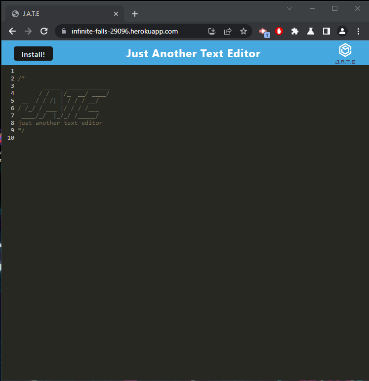
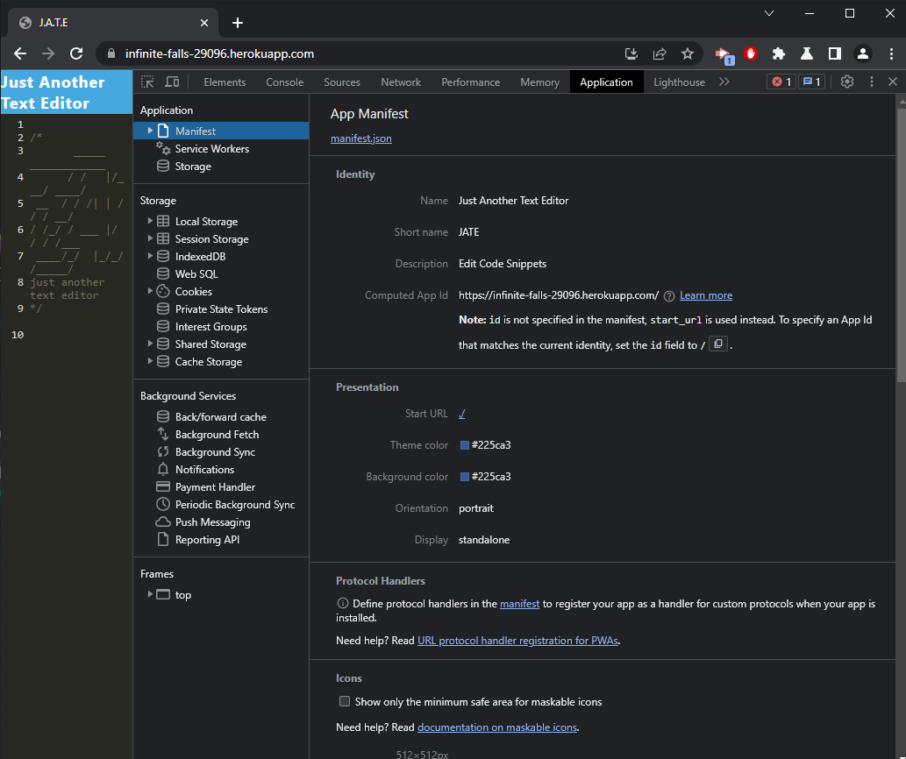
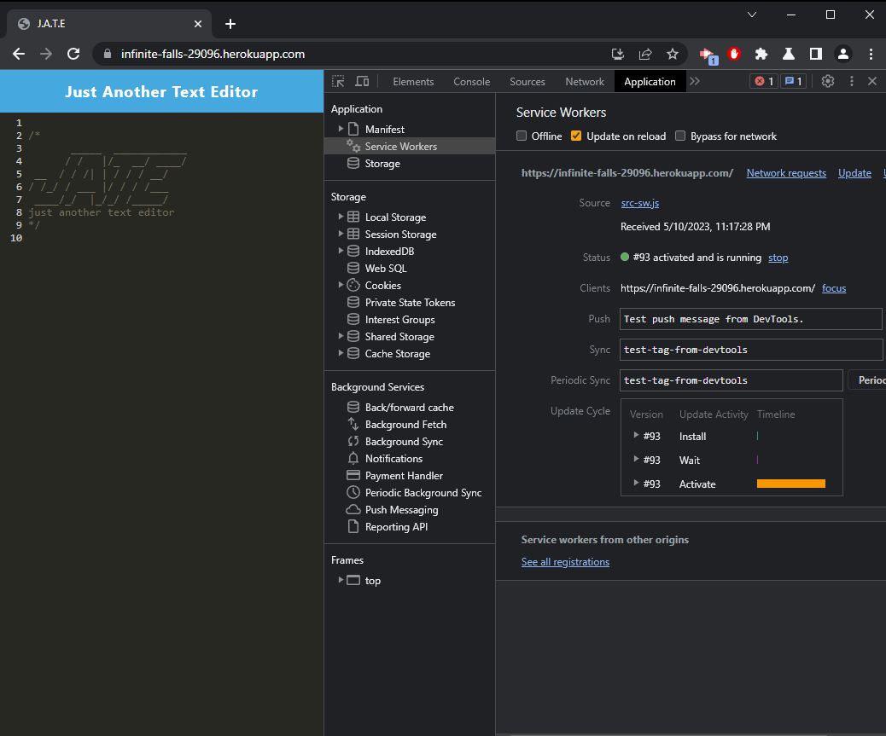
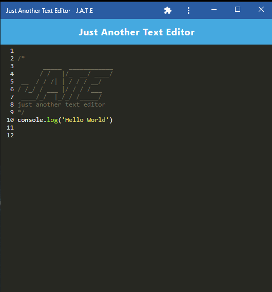

# Progressive-Web-App-Text-Editor-Model
Application created during the UCI bootcamp class, in order to demonstrate the Progressive Web App skills

## Deployed App

[Just Another Text Editor](https://infinite-falls-29096.herokuapp.com/)

## Screenshots






## How to Run
- Application currently only works in Chrome!!!
- Load the deployed page in the link above.
- An IndexDataBase will be created, but will currently be empty.
- Begin typing away in the editor, once you click away from the page, whatever was typed in the editor, will be saved in the indexDB.
- Then when reloading, or closing out and coming back to the page, you'll be presented with the previously typed text in the editor.
- When clicking the install button, you'll be prompted if you'd like to install.
- The program will then install and appear on the desktop.
- To uninstall, click on the column of three dots on the top of the browser, and select
```
Uninstall Just Another Text Editor
```
## About the App

This app was created to show, skills in creating a functioning Progressive Web Application.
In the prosses, the technologies used were:
- Webpack and plugins
- Creating a Service Workers
- Creating a Manifest
- working with the browsers indexDB 

## User Story

```md
AS A developer
I WANT to create notes or code snippets with or without an internet connection
SO THAT I can reliably retrieve them for later use
```

## Acceptance Criteria

```md
GIVEN a text editor web application
WHEN I open my application in my editor
THEN I should see a client server folder structure
WHEN I run `npm run start` from the root directory
THEN I find that my application should start up the backend and serve the client
WHEN I run the text editor application from my terminal
THEN I find that my JavaScript files have been bundled using webpack
WHEN I run my webpack plugins
THEN I find that I have a generated HTML file, service worker, and a manifest file
WHEN I use next-gen JavaScript in my application
THEN I find that the text editor still functions in the browser without errors
WHEN I open the text editor
THEN I find that IndexedDB has immediately created a database storage
WHEN I enter content and subsequently click off of the DOM window
THEN I find that the content in the text editor has been saved with IndexedDB
WHEN I reopen the text editor after closing it
THEN I find that the content in the text editor has been retrieved from our IndexedDB
WHEN I click on the Install button
THEN I download my web application as an icon on my desktop
WHEN I load my web application
THEN I should have a registered service worker using workbox
WHEN I register a service worker
THEN I should have my static assets pre cached upon loading along with subsequent pages and static assets
WHEN I deploy to Heroku
THEN I should have proper build scripts for a webpack application
```

## About

Created by Nathan Shaw
Github: [nshaw973](https://github.com/nshaw973)